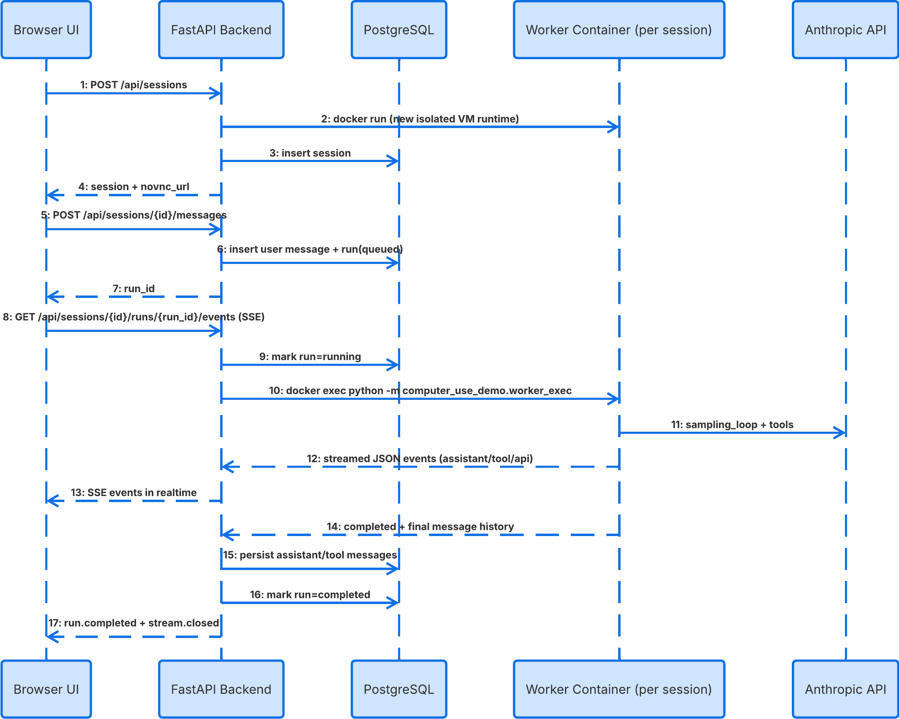

# VM Session Manager with concurrent session support


## Reused From Anthropic Quickstart

This implementation intentionally reuses the existing computer-use stack from:

https://github.com/anthropics/anthropic-quickstarts/tree/main/computer-use-demo

Reused components:

- `computer_use_demo/loop.py` (Anthropic tool loop)
- `computer_use_demo/tools/*` (computer, bash, edit tools)
- VM image stack in `Dockerfile` and `image/*` (Xvfb, mutter, x11vnc, noVNC)

Replacement made:

- Streamlit UI is removed from default runtime flow
- Added FastAPI backend and API-driven frontend

## High-Level Architecture

- Backend API: FastAPI (`computer_use_demo/api/app.py`)
- Runtime isolation: one worker container per session (dynamic spawn)
- Persistence: PostgreSQL (docker-compose) or SQLite (fallback)
- Streaming: SSE endpoint per run
- Frontend: static HTML/CSS/JS served by FastAPI

### Sequence Diagram



## Why This Solves Concurrency

### Isolation model

- Each session gets its own worker container and desktop runtime.
- Each worker container has an independent X display + noVNC server.
- Session A and Session B do not share mouse/keyboard/display state.

### Race-condition controls

- Per-session `asyncio.Lock` in backend:
  - serializes runs within one session
  - allows full parallel runs across different sessions
- DB commits are transactional for session/run/message updates.
- Event streaming has per-run channels with backlog buffering.

### Dynamic scalability

- New sessions dynamically spawn new worker containers.
- No hard-coded limit of “2 sessions”.
- Concurrency is bounded only by machine resources and Docker capacity.

## API Endpoints

Base URL: `http://localhost:8000`

### Health

- `GET /api/health`

### Sessions

- `POST /api/sessions`
  - Creates a new task session and worker container
- `GET /api/sessions`
  - Lists sessions
- `GET /api/sessions/{session_id}`
  - Gets session details
- `DELETE /api/sessions/{session_id}`
  - Deletes session and removes worker container

### Messages and Runs

- `GET /api/sessions/{session_id}/messages`
  - Returns persisted message history
- `POST /api/sessions/{session_id}/messages`
  - Submits user prompt; creates run and starts background execution
- `GET /api/sessions/{session_id}/runs/{run_id}`
  - Run status
- `GET /api/sessions/{session_id}/runs/{run_id}/events`
  - SSE stream of realtime progress

### VNC

- Session response includes `novnc_url` (session-specific noVNC endpoint)

## SSE Event Types

Examples emitted during execution:

- `run.started`
- `assistant.block`
- `tool.result`
- `api.exchange`
- `run.agent_completed`
- `run.completed`
- `run.failed`
- `stream.closed`

## Frontend Demo UI

Served at:

- `GET /`

UI layout:

- Left: task history + create session
- Middle: live noVNC frame for selected session
- Right top: realtime session events and chat interactions
- Right bottom: file management placeholder area

Files:

- `computer_use_demo/static/index.html`
- `computer_use_demo/static/styles.css`
- `computer_use_demo/static/app.js`

## Local Development (Docker)

### 1) Build the worker image (required once)

```bash
docker build . -t computer-use-worker:local
```

### 2) Set API key

```bash
cp .env.example .env
# edit .env and set ANTHROPIC_API_KEY=...
```

### 3) Start backend + database

```bash
docker compose up --build
```

### 4) Open app

- `http://localhost:8000`

## Runtime Environment Variables

Values are read from `.env` (for `docker compose`) and also loaded by backend config for local runs.

- `ANTHROPIC_API_KEY` (required for Anthropic provider)
- `SESSION_WORKER_IMAGE` (default `computer-use-worker:local`)
- `DATABASE_URL` (set by compose to PostgreSQL)
- `API_PROVIDER` (default `anthropic`)
- `DEFAULT_MODEL` (default `claude-sonnet-4-5-20250929`)
- `DEFAULT_TOOL_VERSION` (default `computer_use_20250124`)
- `DEFAULT_WIDTH`, `DEFAULT_HEIGHT` (VM resolution)

## Non-Docker Local Run (optional)

```bash
./setup.sh
cp .env.example .env
# edit .env and set ANTHROPIC_API_KEY=...
export DATABASE_URL=sqlite+aiosqlite:///./data/sessions.db
export SESSION_WORKER_IMAGE=computer-use-worker:local
uvicorn computer_use_demo.api.app:app --reload --port 8000
```

## Data Persistence Model

Tables:

- `sessions`: session metadata and worker container mapping
- `runs`: execution state (`queued/running/completed/failed`)
- `messages`: persisted chat/tool history JSON blocks

Persistence includes:

- User prompts
- Assistant blocks
- Tool use/results blocks
- Full cross-run chronological history by session

## Assessment Demo Script (5 minutes)

### Repository + startup

1. Show repository structure and key backend files.
2. Run:
   - `docker build . -t computer-use-worker:local`
   - `docker compose up --build`
3. Open `http://localhost:8000`.

### Usage case 1

1. Create a new session.
2. Send prompt: `Search the weather in Dubai`.
3. Show realtime streamed events in right panel.
4. Show noVNC VM in middle panel opening Firefox and searching.
5. Show final summary in chat.

### Usage case 2 (strict non-blocking concurrency)

1. Open two browser windows side-by-side.
2. Session A: `Search the weather in Tokyo`.
3. While A is running, in Session B send: `Search the weather in New York`.
4. Show both sessions running in parallel:
   - independent runtime containers
   - independent noVNC URLs/ports
   - realtime streams for both runs simultaneously
5. Show both complete without waiting on each other.

## Code Quality and Validation

Quick checks used during implementation:

```bash
python -m compileall computer_use_demo
```

You can also run the existing project tests:

```bash
pytest
```


